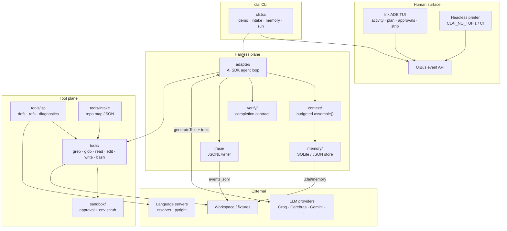
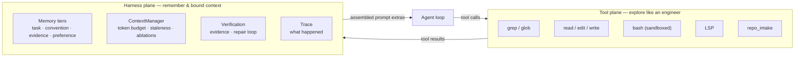
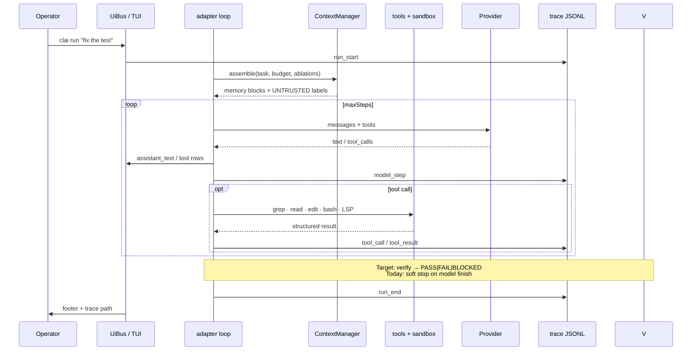
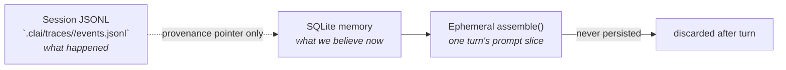
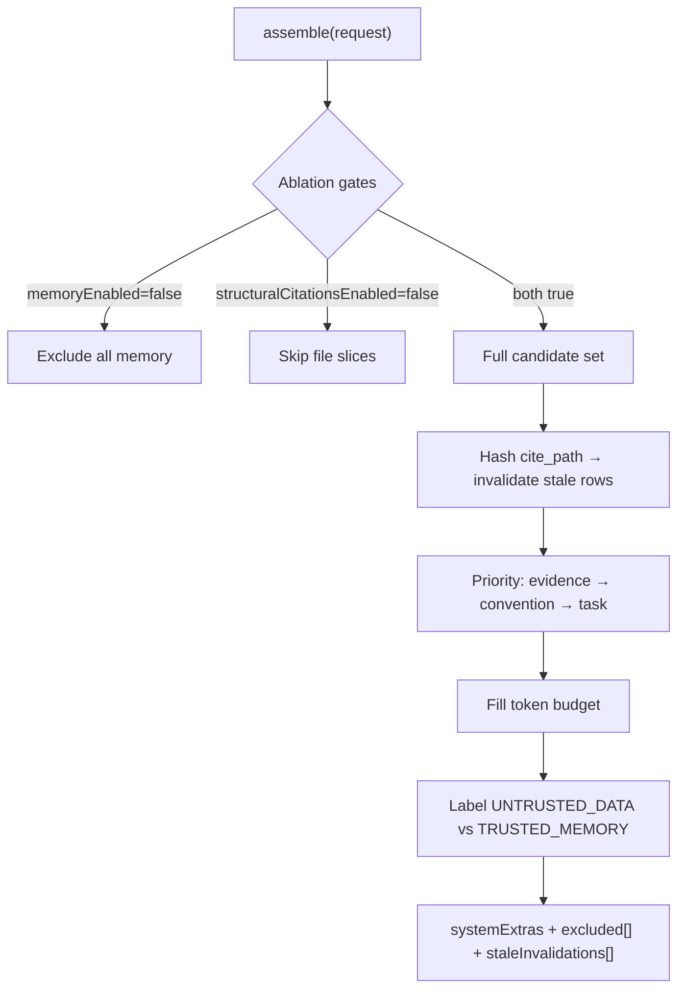
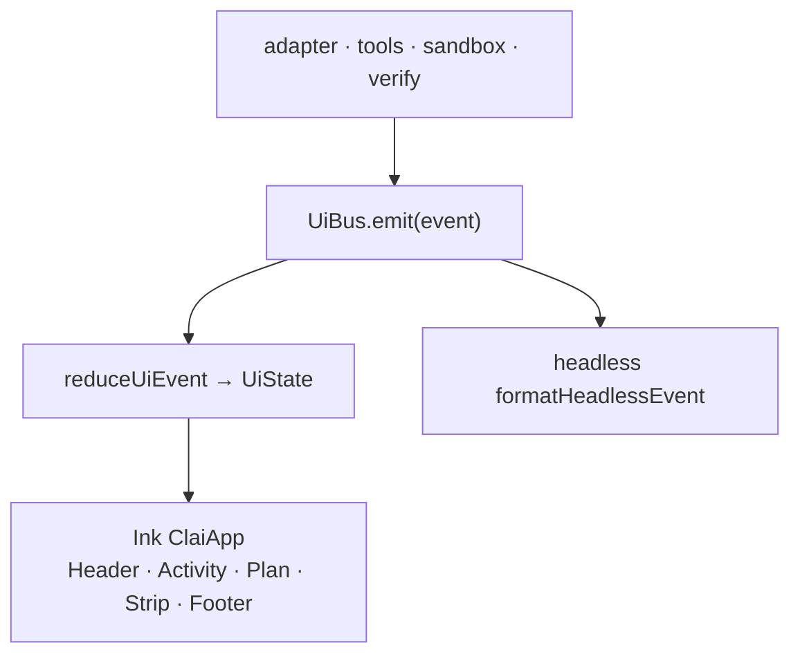
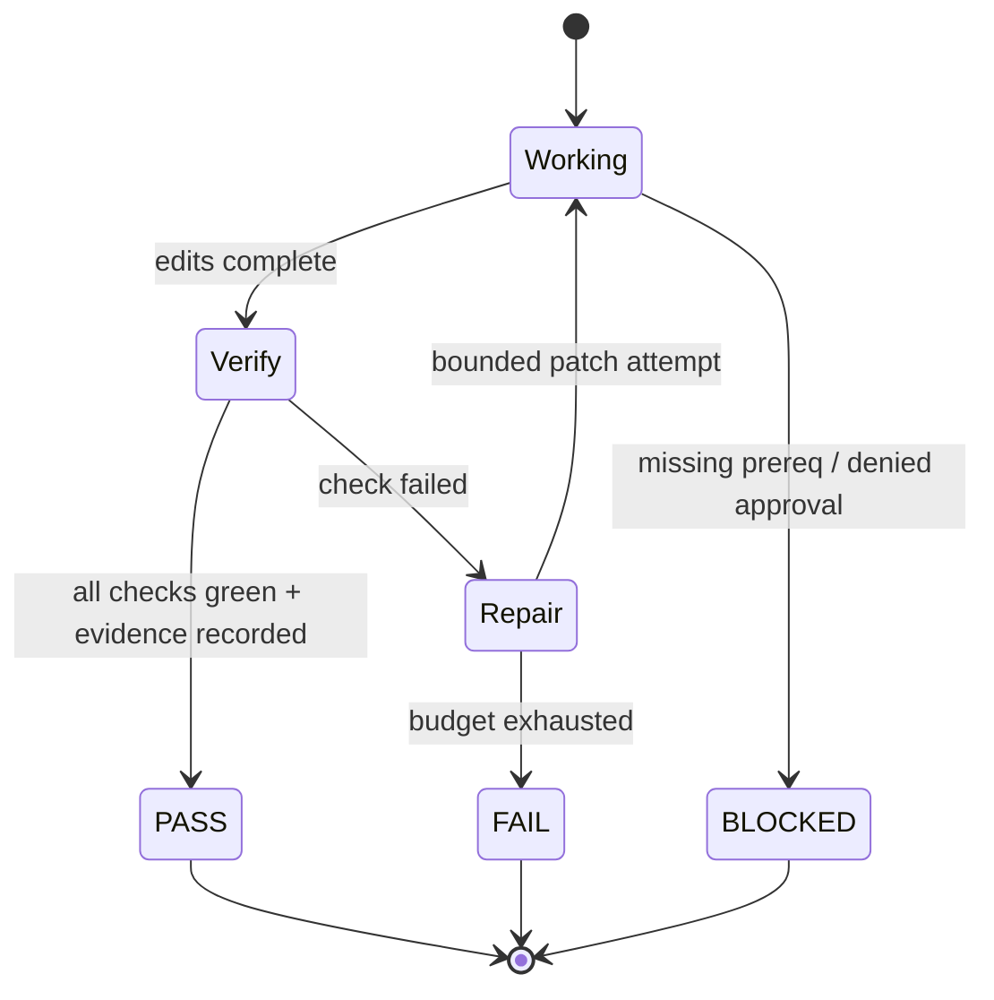
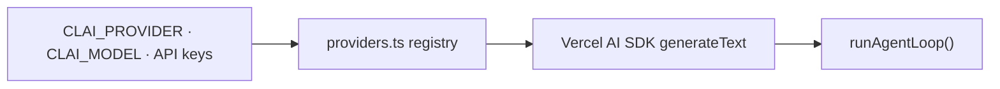

# CLAI Architecture

**Unified Agentic Coding Harness (AE-01)** — single package `clai`, binary `clai`.

This document is a visual map of how CLAI is structured, how a run flows through it, and where it deliberately differs from frontier harnesses like [OpenCode](https://opencode.ai/).

---

## At a glance

| | **CLAI** | **OpenCode** (baseline peer) |
|---|---|---|
| **Shape** | Single TypeScript package, one CLI binary | Client/server micro-OS (TUI + worker + HTTP) |
| **Exploration** | Live tools first (rg, LSP, read) — no vector DB | Live tools + LSP; rules in `AGENTS.md` via `/init` |
| **Memory** | SQLite/JSON with provenance + invalidation | Session history; durable memory is convention/prompt |
| **Context** | Budgeted `assemble()` with real ablation gates | Compaction + prompt; no harness memory plane |
| **Done means** | Designed: `PASS \| FAIL \| BLOCKED` + evidence *(verify seam in progress)* | Model `stop` finish reason — tests are advisory |
| **Trace** | Append-only JSONL under `.clai/traces/<runId>/` | Session store + share links |
| **UI** | Ink ADE pane (`UiBus` → TUI or headless) | SolidJS/OpenTUI; event bus across threads |
| **Providers** | Vercel AI SDK registry (`src/adapter/providers.ts`) | 75+ via Models.dev |

---

## System diagram



---

## Two planes (core design choice)

CLAI splits **exploration** from **harness intelligence**. This is architecture, not a two-panel UI — the operator still sees one Pi/OpenCode-like terminal pane.



| Plane | Job | **Not** its job |
|-------|-----|-----------------|
| **Tool** | Find and change code: ripgrep, LSP, bash, read/edit | Global AST index, vector search |
| **Harness** | Durable facts, bounded prompts, proof of work, audit trail | Replace grep/LSP for discovery |

**Rule:** exploratory discovery is never “search the memory table.” Memory cites paths; tools read the live repo.

---

## Run lifecycle



---

## Module seams (`src/`)

```
src/
├── cli.tsx           # Entry: demo, intake, memory CLI, run
├── adapter/          # Vercel AI SDK loop + provider registry
├── tools/            # Tool plane (parallel read-only where safe)
│   ├── intake.ts     # Repository map scanner
│   └── lsp.ts        # Definition / references / diagnostics
├── context/          # Budgeted prompt assembly + ablation gates
├── memory/           # Tiered store (sqlite | json fallback)
├── sandbox/          # @anthropic-ai/sandbox-runtime + stub fallback
├── verify/           # Completion contract (scaffold)
├── trace/            # Append-only JSONL per run
└── ui/               # Ink ADE shell + headless printer
```

### Storage boundaries (no dual-write)



| Store | Owns | Mutability |
|-------|------|------------|
| **JSONL trace** | Messages, tool calls, approvals, costs | Append-only |
| **Memory DB** | Conventions, evidence, task notes | Invalidate / supersede |
| **assemble()** | Prompt context for one model turn | Ephemeral |

Working memory (current file, last grep) lives in **JSONL / in-process state**, not SQLite.

---

## Context & memory (why it beats prompt-only harnesses)



**OpenCode** records build/test/lint hints in project rules (`AGENTS.md` from `/init`) and relies on the model to run them. **CLAI** adds:

1. **Queryable memory** with `source`, `tier`, and `superseded_by` for audit.
2. **Staleness gate** — cited files re-hashed at assemble time; stale claims invalidated automatically.
3. **Real ablations** — `memoryEnabled` and `structuralCitationsEnabled` are boolean gates, not “fetch everything then zero weights.”
4. **Injection resistance** — repo text and repo-derived memory enter the prompt inside `UNTRUSTED_DATA` blocks with an explicit safety rule.

---

## Tool plane

| Tool | Role | Notes |
|------|------|-------|
| `grep` | Ripgrep JSON → Node fallback | Parallel-safe read-only |
| `glob` | fast-glob patterns | Workspace-confined paths |
| `read` / `edit` / `write` | File I/O | Edit uses exact match |
| `bash` | Shell via sandbox | Approval for egress / destructive / out-of-repo |
| `lsp_*` | TS/Python navigation & diagnostics | Required for eval task set |
| `repo_intake` | Structured repo map | `clai intake` prints JSON |

All paths resolve under `workspaceRoot` — the harness cannot wander outside the fixture/repo.

---

## UI architecture



One event stream, two renderers — interactive TTY gets the ADE pane; CI/pipes get the same semantics as plain lines. OpenCode uses a similar separation (worker thread vs TUI) but over RPC + a global event bus across a larger runtime.

---

## Verification: the biggest harness delta vs OpenCode

OpenCode’s session loop ends when the model emits `stop` with no pending tool calls. Tests, lint, and build are **prompt guidance**, not runtime predicates — a [known gap](https://github.com/anomalyco/opencode/issues/20873) with active proposals for verification gates.

CLAI’s **target contract** (see `verify/` + wayfinder spec):



| Criterion | OpenCode today | CLAI design |
|-----------|----------------|-------------|
| Terminal state | Model `stop` | `PASS \| FAIL \| BLOCKED` |
| Tests/lint/build | Model may skip | Required checks after final edit |
| Evidence | Tool stdout in history | Recorded verification artifacts in trace |
| Retry | Provider backoff; doom-loop on 3× identical calls | Bounded diagnose → patch → reverify |
| Step budget expiry | Summary prompt, not failure | `FAIL`, not success |

**Today:** the adapter uses *soft completion* (“stop when the task looks done”) while the `verify` seam is scaffolded. The architecture above is the intentional upgrade path.

---

## Provider adapter



Add or remove providers in one file without touching the loop. Heavy natives (`better-sqlite3`, `sandbox-runtime`) are **lazy-imported** so `clai --help` stays fast — including on Windows ARM where natives may be absent (stub sandbox, JSON memory fallback).

---

## Side-by-side: when CLAI is the better harness

### CLAI wins on

| Area | Why |
|------|-----|
| **Eval reproducibility** | JSONL traces + ablation flags + memory provenance → judges can replay *what the harness believed* |
| **Honest completion** | Verification contract aims for evidence-based `PASS`, not “model stopped talking” |
| **Context discipline** | Token budget, staleness invalidation, injection labels — not just compaction |
| **Simplicity** | One package, clear seams (`adapter` / `tools` / `memory` / `context` / `trace`) |
| **Offline demos** | `clai demo`, `clai demo lsp`, `clai intake` — no API key required |
| **Platform pragmatism** | Optional deps + stub fallbacks; install succeeds even without C++ toolset |

### OpenCode wins on

| Area | Why |
|------|-----|
| **Surface area** | Terminal + desktop + IDE extensions from one backend |
| **Provider breadth** | 75+ models, Copilot/ChatGPT OAuth, Zen curated models |
| **Maturity** | Permission rulesets, sub-agents, multi-session, huge community |
| **Permission UX** | Tiered allow/ask/deny with glob patterns and doom-loop detection |

CLAI is not trying to clone OpenCode’s product surface — it studies Pi/OpenCode TUI patterns and ships an **original harness** optimized for **verification, memory, and judge-grade traces** on a Terminal-Bench-style loop.

---

## Quick commands (architecture in motion)

```bash
pnpm install
cp .env.example .env          # provider keys

pnpm clai --help              # light entry (lazy heavy imports)
pnpm clai demo                # offline tool plane: edit + bash
pnpm clai demo lsp            # intake + LSP diagnostics
pnpm clai intake --cwd .      # repo map JSON
pnpm clai memory list         # harness plane store
CLAI_NO_TUI=1 pnpm clai run "…"  # headless trace stream
```

Trace artifact: `.clai/traces/<runId>/events.jsonl`

---

## References

- Repo agent guide: [`AGENTS.md`](../AGENTS.md)
- Memory & context spec: [`.scratch/wayfinder-bodies/memory-context-architecture.md`](../.scratch/wayfinder-bodies/memory-context-architecture.md)
- OpenCode peer verification note: [`.scratch/wayfinder-bodies/assets/06-peer-verify-opencode.md`](../.scratch/wayfinder-bodies/assets/06-peer-verify-opencode.md)
- Wayfinder map (ticket spine): [GitHub issue #1](https://github.com/rajofearth/CodeRush2.0_TeamKnull/issues/1)
