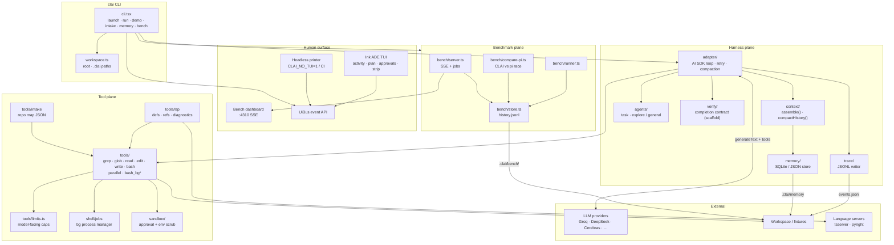
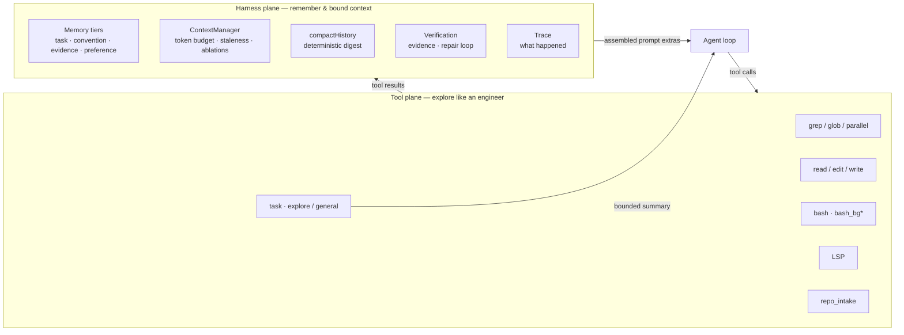
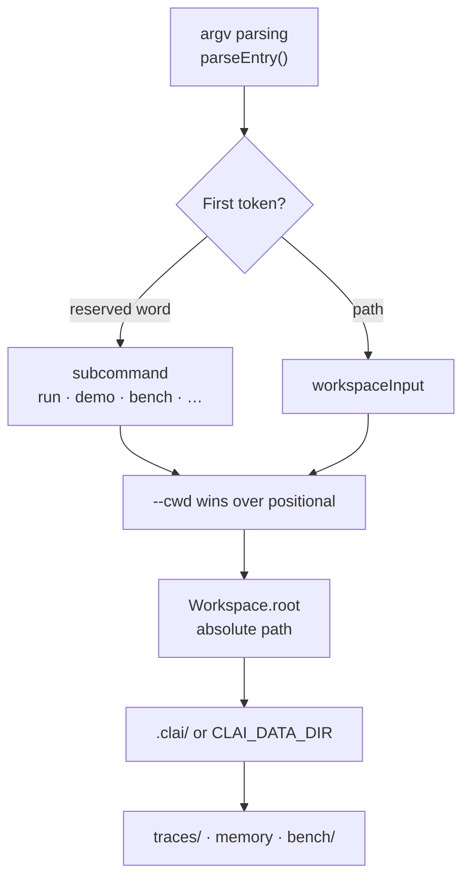
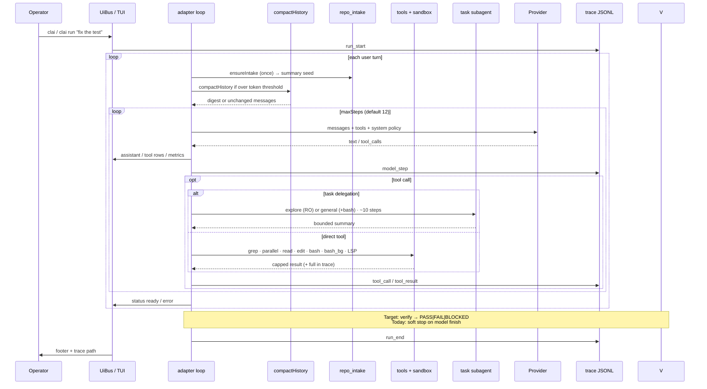
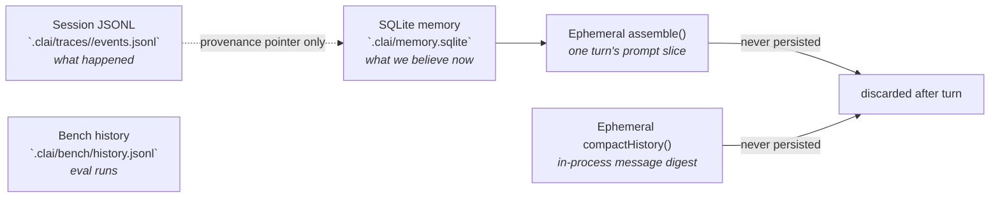
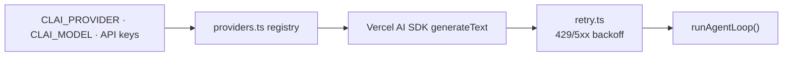
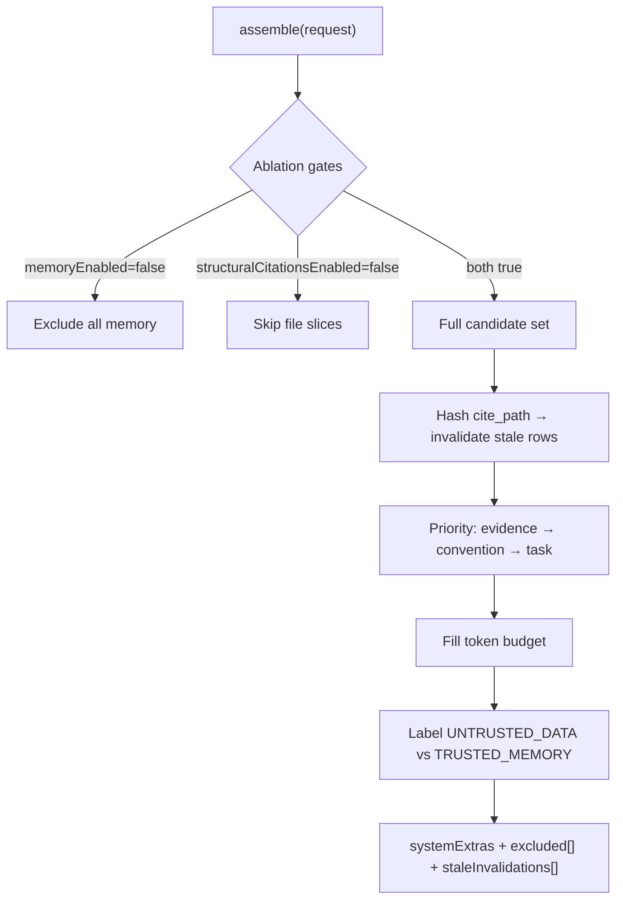
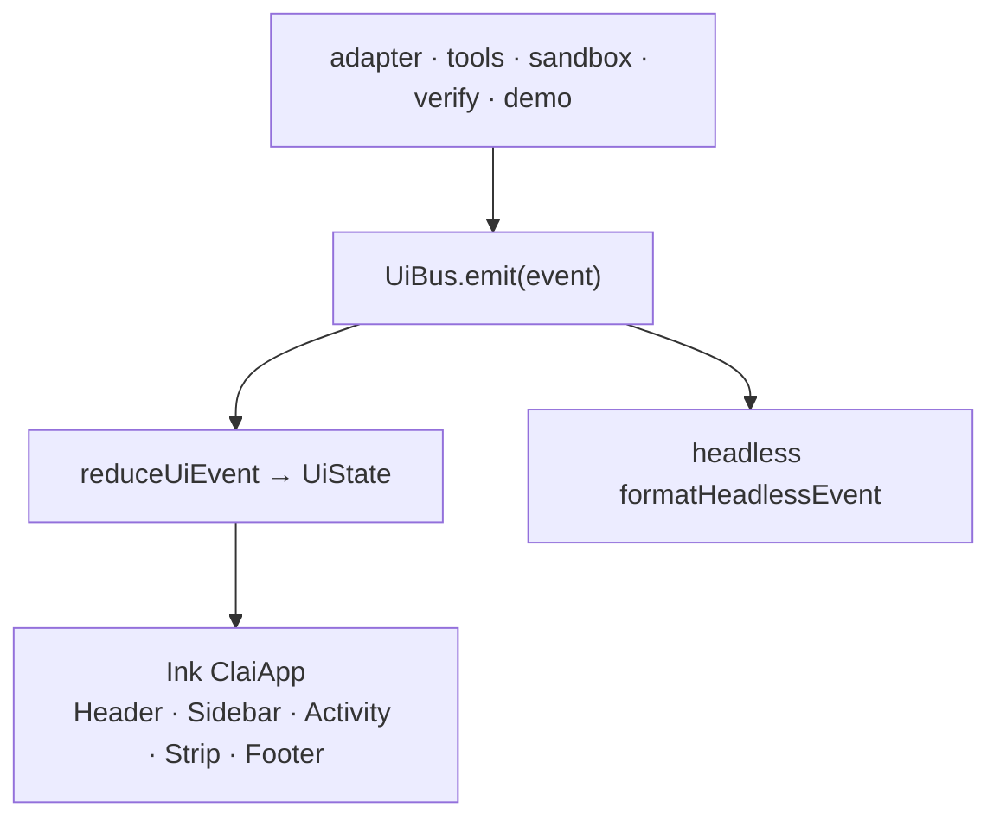
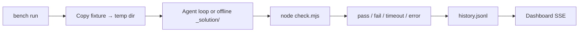
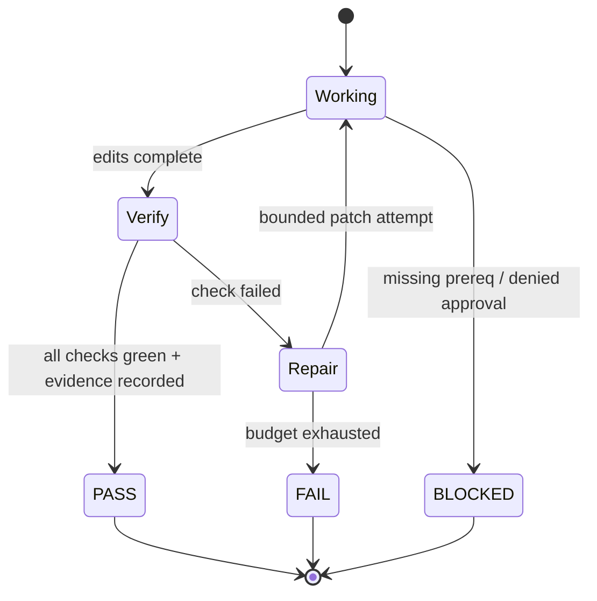

# CLAI Architecture

**Unified Agentic Coding Harness (AE-01)** — single TypeScript package `clai`, binary `clai`.

This document is a visual and structural map of how CLAI is organized, how a run flows through it, and where it deliberately differs from frontier harnesses like [OpenCode](https://opencode.ai/).

---

## At a glance

| | **CLAI** | **OpenCode** (baseline peer) |
|---|---|---|
| **Shape** | Single TypeScript package, one CLI binary | Client/server micro-OS (TUI + worker + HTTP) |
| **Exploration** | Live tools first (rg, LSP, read) — no vector DB | Live tools + LSP; rules in `AGENTS.md` via `/init` |
| **Memory** | SQLite/JSON with provenance + invalidation | Session history; durable memory is convention/prompt |
| **Context** | Budgeted `assemble()` + deterministic history compaction | Compaction + prompt; no harness memory plane |
| **Subagents** | `task` tool — `explore` (read-only) / `general` (+bash); bounded summary return | Sub-agents, multi-session |
| **Benchmarks** | Built-in 81-task bench + live SSE dashboard + CLAI vs pi compare | Community evals; no first-party harness bench |
| **Done means** | Designed: `PASS \| FAIL \| BLOCKED` + evidence *(verify seam scaffolded)* | Model `stop` finish reason — tests are advisory |
| **Trace** | Append-only JSONL under `.clai/traces/<runId>/` | Session store + share links |
| **UI** | Ink ADE pane (`UiBus` → TUI or headless) | SolidJS/OpenTUI; event bus across threads |
| **Providers** | Vercel AI SDK registry (`src/adapter/providers.ts`) | 75+ via Models.dev |

---

## System diagram



---

## Two planes (core design choice)

CLAI splits **exploration** from **harness intelligence**. This is architecture, not a two-panel UI — the operator still sees one Pi/OpenCode-like terminal pane.



| Plane | Job | **Not** its job |
|-------|-----|-----------------|
| **Tool** | Find and change code: ripgrep, LSP, bash, read/edit | Global AST index, vector search |
| **Harness** | Durable facts, bounded prompts, proof of work, audit trail | Replace grep/LSP for discovery |

**Rule:** exploratory discovery is never “search the memory table.” Memory cites paths; tools read the live repo.

---

## Workspace model

Every session is anchored to a single resolved **workspace root** (`src/workspace.ts`). The root governs tool cwd, trace paths, memory store location, and intake scans — not scattered `process.cwd()` calls.



| Field | Path | Role |
|-------|------|------|
| `Workspace.root` | User-supplied folder | Tool sandbox boundary, intake scan root |
| `Workspace.dataDir` | `<root>/.clai` or `CLAI_DATA_DIR` | All harness artifacts |
| `Workspace.tracesDir` | `<dataDir>/traces` | Per-run JSONL directories |
| `Workspace.isGitRepo` | `.git` present | Intake git summary; non-fatal note if absent |

**Subcommand vs path tie-breaker:** bare words `run`, `demo`, `intake`, `memory`, `bench`, `help` are subcommands. Anything else is a folder path. Use `clai -- demo` or `clai --cwd demo` when the folder name collides with a subcommand.

---

## CLI entry points

| Command | API key | Description |
|---------|---------|-------------|
| `clai` / `clai <folder>` | Yes | Interactive Ink session on the workspace root |
| `clai run "<prompt>"` | Yes | Single-turn (headless) or first-turn + interactive (TTY) |
| `clai demo` | No | Offline edit+bash on `fixtures/tiny-edit` |
| `clai demo lsp` | No | Offline intake + LSP diagnostics on `fixtures/lsp-ts` |
| `clai demo injection` | No | Red-team memory/context assembly demo |
| `clai glass [--run] [--follow-latest]` | No | Live glass-box view of context assembly (second terminal) |
| `clai intake` | No | Print repository intake map JSON |
| `clai memory list\|get\|set\|delete\|export` | No | Harness memory store CLI |
| `clai bench run\|serve\|list` | Optional | 81-task benchmark suite + live dashboard |

Heavy modules (`adapter`, `sandbox`, `bench`, `memory`) are **lazy-imported** so `clai --help` stays fast.

---

## Run lifecycle

### Interactive session (`clai` / `clai run`)



**What runs today vs designed:**

| Stage | Status | Notes |
|-------|--------|-------|
| Intake summary seed | **Wired** | First turn runs `repo_intake`; product one-liner appended to system context |
| `ContextManager.assemble()` | **Wired for glass observability** | Emits `context_stage` into the run trace each turn; prompt injection remains opt-in (`injectAssembledContext`) |
| `compactHistory()` | **Wired** | Triggers at ~45k estimated tokens; keeps original task + last N messages |
| Multi-tool-call parallelism | **Wired** | AI SDK runs multiple tool calls in one step concurrently |
| `task` subagent | **Wired** | `explore` (read-only) or `general` (+bash); multiple `task` calls parallelize |
| Background shells | **Wired** | `bash_bg` / `bash_jobs` / `bash_output` / `bash_kill` via `ShellJobManager` |
| Provider retry | **Wired** | 429/5xx backoff with jitter; quota waits ~60s |
| Tool arg repair | **Wired** | Groq-ish schema mistakes repaired or nudged once |
| Verification gate | **Scaffold** | `verify/` exports empty; loop uses soft completion |

---

## Module seams (`src/`)

```
src/
├── cli.tsx              # Entry: launch, run, demo, intake, memory, bench, glass
├── workspace.ts         # Workspace root resolution + argv parsing
├── adapter/
│   ├── index.ts         # runAgentLoop(), resolveModel(), system policy
│   ├── providers.ts     # Pluggable Vercel AI SDK provider registry
│   ├── retry.ts         # 429/5xx exponential backoff
│   └── env.ts           # .env loading
├── agents/
│   └── task.ts          # explore/general subagent + `task` AI SDK tool
├── tools/
│   ├── index.ts         # grep, glob, read, edit, write, bash, parallel, LSP, intake
│   ├── bg-shell.ts      # bash_bg / bash_jobs / bash_output / bash_kill
│   ├── common.ts        # workspace path confinement, tool events
│   ├── limits.ts        # Model-facing output caps (single truncation layer)
│   ├── lsp.ts           # TS Language Service + Python pyright
│   └── intake.ts        # Repository map scanner
├── shell/
│   └── jobs.ts          # Session-scoped ShellJobManager (bg processes)
├── context/
│   ├── index.ts         # ContextManager.assemble() + ablation gates + stage emit
│   ├── synthesize.ts    # stage 0: raw input → ContextRequest (prompt_synthesis)
│   ├── stages.ts        # context_stage types + flag heuristics
│   └── compact.ts       # Deterministic history compaction
├── memory/
│   ├── index.ts         # SQLite / JSON tiered store
│   └── cli.ts           # memory list|get|set|delete|export
├── sandbox/
│   └── index.ts         # @anthropic-ai/sandbox-runtime + stub fallback
├── verify/
│   └── index.ts         # Completion contract (scaffold)
├── trace/
│   ├── index.ts         # Append-only JSONL per run
│   └── tail.ts          # Reusable read-only events.jsonl tailer
├── glass/
│   └── cli.ts           # `clai glass` entry
├── ui-glass/
│   ├── app.tsx          # Ink glass pane (reuses ui/theme.ts)
│   └── model.ts         # Stage row reducer
├── ui/
│   ├── events.ts        # UiBus + typed UiEvent union
│   ├── state.ts         # reduceUiEvent → UiState
│   ├── app.tsx          # Ink ClaiApp shell
│   ├── bridge.ts        # Tool plane → UiBus adapter
│   ├── headless.ts      # CLAI_NO_TUI / non-TTY printer
│   ├── components.tsx   # Activity, footer, plan, tool rows
│   ├── theme.ts         # Colors, glyphs, wordmark
│   └── mouse.ts         # SGR mouse / alt-screen helpers
├── bench/
│   ├── index.ts         # runBenchCli entry
│   ├── runner.ts        # Parallel task execution + check.mjs
│   ├── server.ts        # Live dashboard (node:http + SSE)
│   ├── store.ts         # history.jsonl + LiveRunFeed
│   ├── jobs.ts          # Dashboard-triggered clai / offline / compare jobs
│   ├── types.ts         # BenchRunRecord, LiveSnapshot
│   ├── compare-pi.ts    # CLAI vs pi race + scorecard (partial / sideParallel)
│   └── dashboard.html   # Self-contained metrics + compare UI
└── demo/
    ├── offline.ts       # No-API edit+bash happy path
    ├── lsp.ts           # Intake + diagnostics demo
    └── injection.ts     # Memory/context injection resistance demo
```

### Storage boundaries (no dual-write)



| Store | Owns | Mutability |
|-------|------|------------|
| **JSONL trace** | Messages, tool calls, approvals, costs, full truncated tool output | Append-only |
| **Bench history** | Run records, aggregates, per-task metrics | Append-only |
| **Memory DB** | Conventions, evidence, task notes | Invalidate / supersede |
| **assemble()** | Prompt context for one model turn | Ephemeral |
| **compactHistory()** | Compressed middle of message list | Ephemeral |

Working memory (current file, last grep) lives in **JSONL / in-process state**, not SQLite. Reserved tiers `episodic`, `procedure`, `working` exist in types but are not writable — they belong in session JSONL.

---

## Provider adapter



Default provider: **Groq** (`GROQ_API_KEY`). Override with `CLAI_PROVIDER`.

| `CLAI_PROVIDER` | Env key(s) | Default model |
|-----------------|------------|---------------|
| `groq` | `GROQ_API_KEY` | `openai/gpt-oss-20b` |
| `openrouter` | `OPENROUTER_API_KEY` | `google/gemma-4-31b-it:free` |
| `cerebras` | `CEREBRAS_API_KEY` | `gemma-4-31b` |
| `openai` | `OPENAI_API_KEY` | `gpt-4o-mini` |
| `anthropic` | `ANTHROPIC_API_KEY` | `claude-sonnet-4-20250514` |
| `gemini` | `GEMINI_API_KEY`, `GOOGLE_GENERATIVE_AI_API_KEY` | `gemini-3.5-flash-lite` |
| `gateway` | `AI_GATEWAY_API_KEY`, `VERCEL_AI_GATEWAY_API_KEY` | `google/gemma-4-31b-it` |
| `deepseek` | `DEEPSEEK_API_KEY` | `deepseek-v4-flash` |

Add or remove providers in `src/adapter/providers.ts` without touching the loop. Notable provider quirks handled in-registry:

- **Gemini 3.x** — thought-signature sentinel injected for multi-step tool loops on AI SDK 4
- **OpenRouter free tier** — `data_collection: allow` injected for free endpoints
- **DeepSeek** — OpenAI-compatible base URL at `api.deepseek.com`

Retry policy (`retry.ts`): up to 4 retries on 429/5xx; quota errors wait ~60s base; respects `retry-after` headers; non-retryable errors (401, schema) fail fast as `ProviderError`.

---

## Tool plane

| Tool | Role | Notes |
|------|------|-------|
| `grep` | Ripgrep JSON → Node fallback | Parallel-safe read-only; default 50 matches |
| `glob` | fast-glob patterns | Workspace-confined; empty pattern → `**/*` |
| `read` | File I/O with offset/limit | Head+tail truncation via `limits.ts` |
| `parallel` | Batch ≤6 `grep`/`glob`/`read` | One combined result; prefer native multi-tool-call when possible |
| `edit` | Exact string replacement | Exact `oldString` → `newString` |
| `write` | Create/overwrite text files | Creates parent dirs |
| `bash` | Shell via sandbox | 60s default timeout; approval for egress/destructive/out-of-repo |
| `bash_bg` | Start background shell | Returns job id immediately; session-scoped |
| `bash_jobs` | List bg jobs | Filter `all` / `running` / `done` |
| `bash_output` | Poll bg stdout/stderr | Optional `tail` chars per stream |
| `bash_kill` | Kill bg job | Windows `taskkill` / Unix SIGTERM |
| `lsp_definition` | Go to definition | TS Language Service; Python via pyright when installed |
| `lsp_references` | Find references | Same engines as definition |
| `lsp_diagnostics` | Errors/warnings | Prefer after edits |
| `repo_intake` | Structured repo map | Languages, entrypoints, configs, test hints, summary |
| `task` | Subagent delegation | `explore` (RO) or `general` (+bash); ~10 step budget; summary-only to parent |

**Parallelism:** the Vercel AI SDK runs multiple tool calls emitted in one model step concurrently. Prefer that for independent reads/greps/`task` calls. Use `parallel({jobs:[…]})` when a single batched result is clearer.

**Background shells:** `ShellJobManager` (`src/shell/jobs.ts`) holds in-memory jobs for the session. Env scrub + destructive/egress approval apply on `bash_bg`. Subagents do not inherit `shellJobs` (bg control stays on the parent).

All paths resolve under `workspaceRoot` via `resolveInWorkspace()` — the harness cannot wander outside the fixture/repo.

### Subagents (`agents/task.ts`)

Parent loop wires `task` via `createTaskTool` (not included in the child's toolset — no recursion).

| Kind | Tools | Use |
|------|-------|-----|
| `explore` (default) | grep/glob/read/LSP/intake | Broad read-only investigation |
| `general` | explore tools + `bash` | Verify-oriented digs (tests, git, typecheck) |

Multiple `task` calls in one step run in parallel. Only a capped plain-text summary returns to the parent (`CLAI_TASK_MAX_STEPS`, default 10).

### Output caps (`tools/limits.ts`)

Tool implementations return full results (with source-level safety caps). A **single truncation layer** caps what enters the model's message history. When truncated, the full output is appended to the JSONL trace with a marker telling the model how to re-fetch (narrower grep, read with offset/limit, etc.).

| Cap | Value |
|-----|-------|
| `read` content | 8 KB (6 KB head + 2 KB tail) |
| `grep` matches | 100 |
| `bash` stdout+stderr | 4 KB |
| `glob` paths | 200 |
| `lsp_*` items | 100 |
| `task` summary | 2 KB to parent |

### LSP engines

| Language | Engine | External binary |
|----------|--------|-----------------|
| TypeScript / JavaScript | TypeScript Language Service | Bundled via `typescript` (no external binary) |
| Python | pyright / basedpyright | Optional; `CLAI_LSP_PY` override |
| Missing server | Structured stub (`ok: false, stub: true`) | Never hard-throws |

`probeLspAvailability()` runs at session start; available engines appear in the UI context strip.

---

## Context & memory

CLAI has **two complementary context mechanisms**:

### 1. History compaction (`context/compact.ts`) — wired in main loop

When estimated message tokens exceed ~45k (`CLAI_COMPACT_THRESHOLD_TOKENS`), older turns collapse into a deterministic digest:

- Keeps the original user task and the last N messages verbatim (`CLAI_COMPACT_KEEP_TURNS`, default 10)
- Tool call/result pairs → one-line outcomes
- Superseded reads of the same path dropped
- Files touched by edit/write listed
- No extra model call

### 2. Memory assembly (`context/index.ts`) — built, demo-wired

`ContextManager.assemble()` implements the full harness memory plane:



**OpenCode** records build/test/lint hints in project rules and relies on the model to run them. **CLAI** adds:

1. **Queryable memory** with `source`, `tier`, and `superseded_by` for audit.
2. **Staleness gate** — cited files re-hashed at assemble time; stale claims invalidated automatically.
3. **Real ablations** — `memoryEnabled` and `structuralCitationsEnabled` are boolean gates, not “fetch everything then zero weights.”
4. **Injection resistance** — repo text and repo-derived memory enter the prompt inside `UNTRUSTED_DATA` blocks with an explicit safety rule.

Demonstrated by `clai demo injection` against `fixtures/red-team-readme/`.

### Memory store (`memory/index.ts`)

| Tier | Writable | Default TTL |
|------|----------|---------------|
| `task` | Yes | `task` |
| `convention` | Yes | `durable` |
| `evidence` | Yes | `permanent` |
| `preference` | Yes | `permanent` |
| `episodic`, `procedure`, `working` | No (reserved) | — use JSONL |

Backends: **SQLite** (`better-sqlite3`, WAL mode) with automatic **JSON fallback** when natives are unavailable. Force JSON with `CLAI_MEMORY_BACKEND=json`.

CLI: `clai memory list|get|set|delete|export` with `--tier`, `--cite`, `--supersedes`, `--data-dir`.

---

## Sandbox

`src/sandbox/index.ts` wraps `@anthropic-ai/sandbox-runtime` with a structured stub fallback.

| Mode | When | Behavior |
|------|------|----------|
| `runtime` | Native sandbox initializes | `wrapWithSandbox()` + scrubbed env |
| `stub` | Windows ARM, missing binary, init timeout | Scrubbed env + approval hooks still apply |

**Approval kinds** (deny-by-default unless `CLAI_AUTO_APPROVE=1`):

- `egress` — curl, wget, npm publish, etc.
- `destructive` — rm -rf, format, dd, etc.
- `out_of_repo` — cwd outside workspace root

Env scrub removes `*_API_KEY`, `*_TOKEN`, `*_SECRET`, and similar before any shell execution. `.env` / `.env.local` are deny-write in runtime filesystem policy.

---

## Trace

Append-only JSONL at `.clai/traces/<runId>/events.jsonl`.

| Event type | Payload |
|------------|---------|
| `run_start` | cwd, timestamp |
| `run_end` | status (`ok` / `fail`), extras |
| `model_step` | provider, finishReason, toolCalls, usage |
| `assistant_text` | model prose (truncated at 4k chars in trace) |
| `tool_call` / `tool_result` | tool name, target, duration; full output when capped |
| `tool_repair` | schema repair attempts |
| `approval` | gate decisions |
| `error` | failures, recovery flags |
| `info` | compaction, provider_retry, subagent scope |
| `context_stage` | ContextManager.assemble() stage start/complete (glass pane) |

Every run gets an 8-char UUID prefix as `runId`. Bench tasks write separate traces per task under temp workspaces.

### Glass pane (`clai glass`)

Parallel observability surface — a **second terminal process** that tails the active (or pinned) run's `events.jsonl` and renders the Context Manager pipeline stage-by-stage. Read-only consumer of the existing append-only trace format; does not modify UiBus or the main Ink ADE.

| Flag | Behaviour |
|------|-----------|
| `--follow-latest` (default when no `--run`) | Tail the most recently modified run under `.clai/traces/`; auto-switch when a new run starts |
| `--run <runId>` | Pin to a run and replay from the start (safe demo without a live LLM call) |

Stages (in order): `prompt_synthesis` → `query_planner` → `structural_retrieval` → `memory_retrieval` → `relevance_scoring` → `stale_check` → `injection_scan` → `token_budget` → `summarizer`.

| Stage | Detail payload (complete) |
|-------|---------------------------|
| `prompt_synthesis` (stage 0) | `{ rawInput, synthesizedQuery: { taskId, agentRole, targetFragments, freeTextQuery, tokenBudget }, extractionNotes }` — minted `requestId` is the correlation origin for the rest of the pipeline |
| `query_planner` | `{ tiers, targetFragments, agentRole }` |
| `structural_retrieval` | `{ fragmentsFound, edgesExpanded }` |
| `memory_retrieval` | `{ tiersQueried, itemsFound, excludedInvalidated }` |
| `relevance_scoring` | `{ candidateCount, topScored }` |
| `stale_check` | `{ checked, staleFound, reindexed, memoryInvalidated }` |
| `injection_scan` | `{ scanned, untrustedFlagged }` |
| `token_budget` | `{ budget, included, summarized, excluded, tokensUsed }` |
| `summarizer` | `{ demoted }` |

Stage 0 is emitted by `synthesizeContextRequest()` ahead of `ContextManager.assemble()`; stages 1–8 emit from assemble(). Reusable tailer: `src/trace/tail.ts`. Ink entry: `src/ui-glass/` (reuses `src/ui/theme.ts`). The glass pane renders `prompt_synthesis` as a two-line panel (raw › synthesized tags) above the remaining pipeline rows.

---

## UI architecture



One event stream, two renderers — interactive TTY gets the ADE pane; CI/pipes get the same semantics as plain lines.

**UiEvent types:** `user`, `assistant`, `tool_call`, `tool_result`, `plan`, `todo`, `approval`, `verify`, `status`, `metrics`, `context`.

Interactive session features: multi-turn prompt box, pgup/pgdn scroll, ctrl+c interrupt (marks status, does not kill in-flight provider call), context strip showing model/provider/sandbox/LSP/trace path.

Headless: set `CLAI_NO_TUI=1` or run on non-TTY stdout. Requires explicit prompt via `clai run "<prompt>"`.

---

## Benchmark system

Built-in Terminal-Bench-style eval loop over **81** self-contained Node.js fixtures in `fixtures/bench/`:

- **8 legacy tasks** — original CLAI mini-repo tasks (`fix-async-race`, `implement-slugify`, …)
- **73 adapted tasks** — themes from [Terminal-Bench 2.1](https://github.com/harbor-framework/terminal-bench-2-1) and [DeepSWE](https://deepswe.datacurve.ai/), rewritten as isolated `.mjs` workspaces with `check.mjs` verifiers (no Docker required)

Full manifest: `fixtures/bench/manifest.json` (maps each task to its upstream benchmark id).

Regenerate catalog fixtures:

```bash
pnpm bench:scaffold              # write fixtures from src/bench/task-catalog/
pnpm bench:scaffold -- --force   # overwrite existing catalog tasks
pnpm bench:verify-fixtures       # broken must fail, _solution/ must pass
```



| Command | Description |
|---------|-------------|
| `clai bench list` | List tasks from fixture `task.json` files |
| `clai bench run [--offline] [--parallel N] [--tasks id,id] [--serve]` | Run subset; default parallel 1 live / 3 offline |
| `clai bench serve [--port N]` | Live dashboard only (default port **4310**) |

**Offline mode** (`--offline`): applies `_solution/` patches instead of calling the LLM — no API key required.

**Dashboard** (`bench/server.ts`): plain `node:http`, zero extra deps. Endpoints:

- `GET /` — self-contained `dashboard.html`
- `GET /events` — SSE live snapshots + compare events
- `GET /api/runs`, `GET /api/runs/:id` — history from `.clai/bench/history.jsonl`
- `GET /api/compare` — CLAI vs pi harness scorecard (`compare-pi.json`)
- `GET /api/tasks` — catalog `{ count, ids }` for the dashboard task-limit control
- `POST /api/jobs` — start clai / offline / compare (`limit` = first N catalog tasks; also `parallel`, `tasks`, `freshClai`)

Each task: hard wall-clock timeout, configurable `maxSteps`, isolated temp workspace (fixtures never mutated), per-task trace, token/cost estimates via provider pricing table.

### CLAI vs pi compare (`compare-pi.ts`)

Same-model race (default DeepSeek via `PI_PROVIDER` / `PI_MODEL`; needs `DEEPSEEK_API_KEY` + `pi` on PATH). Start from the dashboard **Compare CLAI vs pi** button, `POST /api/jobs` with `kind: "compare"`, or `pnpm bench:compare-pi`.

Race hardening:

| Behavior | Detail |
|----------|--------|
| **Task limit UI** | Dashboard **10 / +10 / max** sends `limit` on job start (catalog from `/api/tasks`) |
| **Total wall time** | Scoreboard + compare cards show per-harness Σ `wallMs` (live while partial) |
| **Partial scorecards** | `compare.partial: true` while either harness is still running; task table streams live |
| **Scoreboard freeze** | Winner / composite scores stay frozen until `partial` clears (phase `"done"`) |
| **`sideParallel` split** | Fresh CLAI+pi race uses `ceil(COMPARE_PARALLEL/2)` workers per side (override `COMPARE_SIDE_PARALLEL`) so API load is not doubled |
| **Pi stall kill** | If pi emits no JSON stdout within `COMPARE_PI_STALL_MS` (default 45s), the child is killed; stderr/otel noise does not cancel the stall timer |

While a compare job is in flight, `/api/compare` and SSE prefer the in-memory partial card so reconnects never flash a prior finished scoreboard.

---

## Verification: the biggest harness delta vs OpenCode

OpenCode’s session loop ends when the model emits `stop` with no pending tool calls. Tests, lint, and build are **prompt guidance**, not runtime predicates.

CLAI’s **target contract** (see `verify/` + wayfinder spec):



| Criterion | OpenCode today | CLAI design |
|-----------|----------------|-------------|
| Terminal state | Model `stop` | `PASS \| FAIL \| BLOCKED` |
| Tests/lint/build | Model may skip | Required checks after final edit |
| Evidence | Tool stdout in history | Recorded verification artifacts in trace |
| Retry | Provider backoff; doom-loop on 3× identical calls | Bounded diagnose → patch → reverify |
| Step budget expiry | Summary prompt, not failure | `FAIL`, not success |

**Today:** the adapter uses *soft completion* (“stop when the task looks done”) while `verify/index.ts` is an empty scaffold. Bench `check.mjs` scripts provide **external** verification for eval runs only.

---

## Demos & fixtures

| Fixture | Used by | Purpose |
|---------|---------|---------|
| `fixtures/tiny-edit` | `clai demo` | Minimal edit+bash loop with `check.mjs` |
| `fixtures/lsp-ts` | `clai demo lsp` | TypeScript file with intentional type error |
| `fixtures/red-team-readme` | `clai demo injection` | Prompt injection resistance demo |
| `fixtures/bench/*` | `clai bench run` | 81-task eval suite (Terminal-Bench + DeepSWE inspired) |

Offline demos emit JSON summary on headless stdout: `{ ok, runId, sandboxMode, tracePath, … }`.

---

## Environment variables

| Variable | Default | Purpose |
|----------|---------|---------|
| `GROQ_API_KEY` etc. | — | Provider credentials |
| `CLAI_PROVIDER` | first key found; pref groq | Provider selection |
| `CLAI_MODEL` | per-provider default | Model id override |
| `CLAI_NO_TUI` | unset | Force headless output |
| `CLAI_AUTO_APPROVE` | unset | Auto-approve sandbox gates (dev only) |
| `CLAI_DATA_DIR` | `<root>/.clai` | Override harness data directory |
| `CLAI_MEMORY_BACKEND` | sqlite with json fallback | Force `json` backend |
| `CLAI_COMPACT_THRESHOLD_TOKENS` | 45000 | History compaction trigger |
| `CLAI_COMPACT_KEEP_TURNS` | 10 | Verbatim trailing messages after compaction |
| `CLAI_TASK_MAX_STEPS` | 10 | Subagent step budget |
| `CLAI_LSP_PY` | auto-detect | Python language-server binary |
| `CLAI_INVOCATION_CWD` | — | Set by `bin/clai.js` for workspace resolution |

---

## Platform notes

`better-sqlite3` and `@anthropic-ai/sandbox-runtime` are **optionalDependencies**. On Windows ARM64 (or any host without matching natives / VS C++ toolset):

- `pnpm install` still succeeds
- `pnpm clai --help`, `pnpm clai demo`, `pnpm clai bench run --offline` work
- Sandbox falls back to stub mode with `stubReason` recorded
- Memory falls back to JSON file store

Memory on SQLite needs a working native binary (x64 Node + VS Build Tools “Desktop development with C++”, or a platform with prebuilds).

Node **≥ 20** required. Package manager: **pnpm 9**.

---

## Side-by-side: when CLAI is the better harness

### CLAI wins on

| Area | Why |
|------|-----|
| **Eval reproducibility** | JSONL traces + ablation flags + memory provenance → judges can replay *what the harness believed* |
| **Built-in bench** | 81-task suite (TB/DeepSWE adapted), offline mode, live dashboard, pi comparison — no external harness required |
| **Honest completion** | Verification contract aims for evidence-based `PASS`, not “model stopped talking” |
| **Context discipline** | Token budget, staleness invalidation, injection labels, deterministic compaction |
| **Subagent isolation** | `task` (`explore` / `general`) keeps investigation out of parent context |
| **Simplicity** | One package, clear seams (`adapter` / `tools` / `agents` / `shell` / `memory` / `context` / `trace` / `bench`) |
| **Offline demos** | `clai demo`, `clai demo lsp`, `clai intake`, `clai bench run --offline` — no API key |
| **Platform pragmatism** | Optional deps + stub fallbacks; install succeeds even without C++ toolset |

### OpenCode wins on

| Area | Why |
|------|-----|
| **Surface area** | Terminal + desktop + IDE extensions from one backend |
| **Provider breadth** | 75+ models, Copilot/ChatGPT OAuth, Zen curated models |
| **Maturity** | Permission rulesets, sub-agents, multi-session, huge community |
| **Permission UX** | Tiered allow/ask/deny with glob patterns and doom-loop detection |

CLAI is not trying to clone OpenCode’s product surface — it studies Pi/OpenCode TUI patterns and ships an **original harness** optimized for **verification, memory, judge-grade traces, and reproducible benchmarks** on a Terminal-Bench-style loop.

---

## Quick commands

```bash
pnpm install
cp .env.example .env          # provider keys

pnpm clai --help              # light entry (lazy heavy imports)
pnpm clai                     # interactive session on cwd
pnpm clai fixtures/tiny-edit  # session on a fixture
pnpm clai demo                # offline tool plane: edit + bash
pnpm clai demo lsp            # intake + LSP diagnostics
pnpm clai demo injection      # memory/context injection demo
pnpm clai intake --cwd .      # repo map JSON
pnpm clai memory list         # harness plane store
pnpm clai bench list          # 81 eval tasks
pnpm clai bench run --offline --serve   # offline run + dashboard :4310
pnpm bench:compare-pi         # CLAI vs pi scorecard (DeepSeek + pi)
CLAI_NO_TUI=1 pnpm clai run "what's in the codebase" --cwd fixtures/tiny-edit
```

Trace artifact: `.clai/traces/<runId>/events.jsonl`  
Bench history: `.clai/bench/history.jsonl`

---

## References

- User-facing docs / quick start: [`README.md`](../README.md)
- The agent itself: [`CLAI-AGENT.md`](CLAI-AGENT.md)
- Repo agent guide: [`AGENTS.md`](../AGENTS.md)
- Memory & context spec: [`.scratch/wayfinder-bodies/memory-context-architecture.md`](../.scratch/wayfinder-bodies/memory-context-architecture.md)
- OpenCode peer verification note: [`.scratch/wayfinder-bodies/assets/06-peer-verify-opencode.md`](../.scratch/wayfinder-bodies/assets/06-peer-verify-opencode.md)
- Wayfinder map (ticket spine): [GitHub issue #1](https://github.com/rajofearth/CodeRush2.0_TeamKnull/issues/1)
